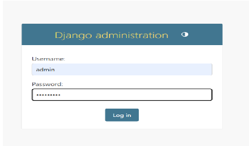

# 📊 Portfolio de Projets Académiques

## 🎯 Vue d'ensemble

Ce portfolio présente une collection de projets académiques démontrant une expertise multidisciplinaire en **statistique appliquée**, **analyse de données**, **développement web**,**Modelisation** et **recherche quantitative**. Ces projets illustrent une approche méthodologique rigoureuse et une maîtrise des outils modernes d'analyse de données.

---

## 🚀 Compétences Techniques Développées

### 📈 **Analyse Statistique & Économétrie**
- **Modélisation hédonique** : Analyse des prix immobiliers à Ouagadougou (2018-2024)
- **Analyse de survie** : Modélisation du temps d'accès au premier emploi
- **Régression logistique conditionnelle** : Modèles de choix discrets
- **Diagnostic de multicolinéarité** : Tests VIF et méthodes de correction
- **Statistiques descriptives avancées** : Analyses exploratoires et inférentielles

### 💻 **Outils de Programmation & Logiciels**
- **R** : tidyverse, glmnet, caret, performance, lmtest
- **STATA** : Régression, tests statistiques, manipulation de données
- **SPSS** : Analyses statistiques et visualisations
- **Python/Django** : Développement d'applications web
- **CSPro** : Saisie et gestion de données d'enquêtes

### 🔬 **Méthodologies de Recherche**
- **Théories économiques appliquées** : Capital humain, signalement, discrimination
- **Design d'enquêtes** : Conception de questionnaires et collecte de données
- **Analyse de données longitudinales** : Études de cohortes et panels
- **Validation de modèles** : Tests d'hypothèses et diagnostics

---

## 📁 Structure des Projets

### 🏠 **1. Modélisation Hédonique des Prix Immobiliers**
**Contexte** : Analyse de l'évolution des prix des terrains à Ouagadougou (2018-2024)

**Compétences démontrées** :
- Modélisation économétrique avancée
- Analyse de 1,811 parcelles avec variables explicatives multiples
- Tests d'autocorrélation (Durbin-Watson)
- Sélection de modèles par critères statistiques
- Interprétation des politiques urbaines sur le marché foncier

**Technologies** : R (tidyverse, glmnet, performance, lmtest)

### 👥 **2. Analyse de Survie - Accès au Premier Emploi**
**Contexte** : Modélisation des facteurs influençant le temps d'accès au premier emploi

**Compétences démontrées** :
- Modèles de survie et analyse de durée
- Intégration de théories économiques (Becker, Spence, Okun)
- Analyse des variables sociodémographiques
- Modélisation des risques et probabilités

**Technologies** : R, STATA

### 📊 **3. Diagnostic de Multicolinéarité**
**Contexte** : Identification et correction des problèmes de multicolinéarité en régression

**Compétences démontrées** :
- Calcul et interprétation des VIF (Variance Inflation Factor)
- Matrices de corrélation et analyse factorielle
- Stratégies de sélection de variables
- Optimisation de modèles de régression

**Technologies** : STATA

### 🌐 **4. Application Web de Gestion de Salles de Classe**
**Contexte** : Développement d'une application web pour la gestion administrative

**Compétences démontrées** :
- Architecture MVC avec Django
- Gestion de base de données SQLite
- Interface utilisateur responsive (Bootstrap)
- Système d'authentification et de permissions
- Déploiement d'applications web

**Technologies** : Python, Django, HTML/CSS, JavaScript, Bootstrap

### 📋 **5. Enquêtes et Collecte de Données**
**Contexte** : Conception et mise en œuvre d'enquêtes statistiques

**Compétences démontrées** :
- Design de questionnaires structurés
- Saisie et validation de données avec CSPro
- Gestion de bases de données d'enquêtes
- Contrôle qualité des données collectées

**Technologies** : CSPro, Excel, STATA

### 📈 **6. Analyses PMA (Performance Monitoring for Action)**
**Contexte** : Analyse de données démographiques et de santé

**Compétences démontrées** :
- Traitement de données complexes avec valeurs manquantes
- Recodage et labellisation de variables
- Analyses bivariées et multivariées
- Pondération et ajustement d'échantillons

**Technologies** : STATA, SPSS

---

## 🎓 Pertinence Académique et Professionnelle

### **Secteurs d'Application**
- **Immobilier & Urbanisme** : Évaluation foncière et politiques urbaines
- **Économie du Travail** : Analyse de l'employabilité et du marché du travail
- **Santé Publique** : Monitoring et évaluation de programmes
- **Développement** : Évaluation d'impact et recherche opérationnelle
- **Technologie** : Développement d'outils d'aide à la décision

### **Valeur Ajoutée**
- **Approche interdisciplinaire** combinant économie, statistique et informatique
- **Méthodologie rigoureuse** avec validation théorique et empirique
- **Maîtrise des outils modernes** d'analyse de données
- **Capacité d'adaptation** à différents contextes et problématiques
- **Compétences en communication** des résultats techniques

---

## 🛠️ Technologies et Environnements

| Catégorie | Outils | Niveau |
|-----------|--------|---------|
| **Statistique** | R, STATA, SPSS | Avancé |
| **Programmation** | Python, Django | Intermédiaire |
| **Base de données** | SQLite, CSPro | Intermédiaire |
| **Visualisation** | ggplot2, STATA Graphics | Avancé |
| **Documentation** | R Markdown, LaTeX | Intermédiaire |

---

## 📞 Contact et Collaboration

Ce portfolio démontre une expertise solide en analyse de données et recherche quantitative, avec une capacité avérée à :
- Concevoir et mener des analyses statistiques complexes
- Développer des solutions technologiques adaptées
- Communiquer efficacement les résultats de recherche
- Travailler en équipe sur des projets multidisciplinaires

**Prêt pour des collaborations** dans les domaines de la recherche quantitative, l'analyse de données, et le développement d'outils d'aide à la décision.

---

*Portfolio mis à jour : Septembre 2025*  
*Tous les projets respectent les standards académiques et méthodologiques en vigueur*